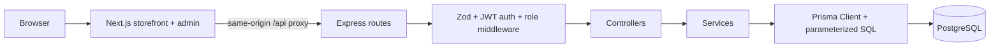
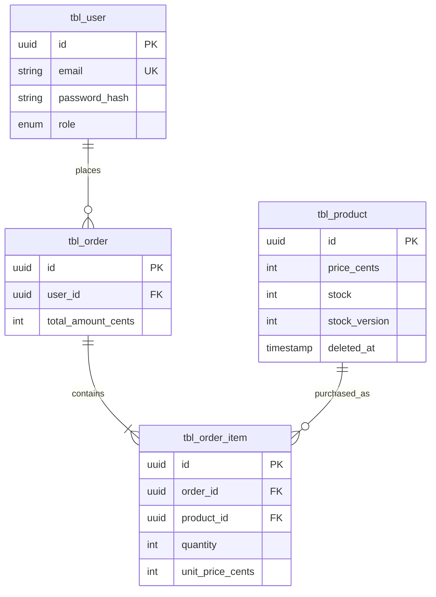

# Architecture

> **Status:** Authentication and admin product/image/inventory management with transactional change logs are implemented.
> Storefront UI and purchasing remain planned. All business pages and APIs require authentication.

[SPEC.md](./SPEC.md) defines the required behavior and acceptance criteria. This document records the technical design
and its trade-offs.

## 1. Overview

Mandai Assessment is a small product storefront and inventory dashboard. One Next.js application serves customer and
admin pages. A separate Express API owns authentication, authorization, product writes, and purchasing. PostgreSQL is
the source of truth for inventory and orders.



The Next.js proxy keeps browser requests and the authentication cookie on one origin. Express remains the API authority;
hiding an admin link in the UI never grants or removes permission.

## 2. Technology choices

| Choice                                     | Reason                                                                                                           |
|--------------------------------------------|------------------------------------------------------------------------------------------------------------------|
| Next.js App Router + TypeScript + Tailwind | One application can serve both page families with shared components and typed UI code.                           |
| Express + TypeScript                       | A small explicit HTTP pipeline is easier to read and explain than a large framework for this scope.              |
| PostgreSQL                                 | Row locking, conditional updates, constraints, and transactions fit inventory and order relationships.           |
| Prisma                                     | Typed models and routine queries; a targeted raw SQL statement expresses the critical inventory update directly. |
| Zod                                        | Reject invalid external input at the HTTP boundary.                                                              |
| JWT + bcrypt                               | Simple take-home authentication with hashed passwords and signed short-lived identity claims.                    |
| pnpm workspaces                            | One repository and dependency graph for the web and API applications.                                            |

## 3. Repository structure

```text
mandai-assessment/
├── apps/
│   ├── web/
│   │   ├── app/                 # storefront, auth, and admin routes
│   │   ├── components/          # shared layout, product, and UI pieces
│   │   └── lib/                 # API client and presentation helpers
│   └── api/
│       └── src/
│           ├── routes/         # route registration
│           ├── middleware/     # validation, auth, role, error handler
│           ├── controllers/    # HTTP input/output mapping
│           ├── services/       # product and purchase rules
│           ├── schemas/        # Zod contracts
│           ├── lib/            # Prisma client and shared utilities
│           ├── app.ts          # Express composition root; health route only
│           └── server.ts       # API listener
├── prisma/                     # schema and SQL migration; seed planned
├── prisma7.config.ts           # Prisma 7 database connection and migration paths
├── DESIGN.md                   # visual source of truth
├── SPEC.md                     # behavior and acceptance criteria
├── ARCHITECTURE.md
├── README.md
├── docker-compose.yml
├── pnpm-workspace.yaml
└── .env.example
```

The web and API scaffold entry points and root `pnpm dev` script now exist. The component and route/controller/service
directories shown above are target structure. The initial schema and migration exist; seed and domain features will be
added during implementation.

## 4. Database schema

Use UUID primary keys and UTC timestamps. All PostgreSQL tables use the requested `tbl_` prefix and singular snake_case
names. Database columns use snake_case. Prisma models remain singular PascalCase and their fields, like API JSON, use
camelCase. Prisma `@@map` and `@map` keep these naming layers separate. This is a naming convention, not a SQL
requirement; PostgreSQL permits underscores and also permits mixed-case identifiers when
quoted. [Prisma's database-mapping documentation](https://docs.prisma.io/docs/orm/v6/prisma-schema/data-model/database-mapping)
describes the mapping mechanism.

| Prisma model | PostgreSQL table | PostgreSQL columns                                                                                                        | Relationships                                                                |
|--------------|------------------|---------------------------------------------------------------------------------------------------------------------------|------------------------------------------------------------------------------|
| `User`       | `tbl_user`       | `id`, `email` (unique), `password_hash`, `role`, `created_at`, `updated_at`                                               | One user has many orders.                                                    |
| `Product`    | `tbl_product`    | `id`, `name`, `description`, `price_cents`, `stock`, `stock_version`, `deleted_at` (nullable), `created_at`, `updated_at` | One product has many order items.                                            |
| `Order`      | `tbl_order`      | `id`, `user_id`, `total_amount_cents`, `created_at`                                                                       | Belongs to a user; has one order item for this single-product purchase flow. |
| `OrderItem`  | `tbl_order_item` | `id`, `order_id`, `product_id`, `quantity`, `unit_price_cents`                                                            | Belongs to an order and a product.                                           |

The current Prisma schema maps `Product.priceCents` to `tbl_product.price_cents`. An abbreviated example:

```prisma
model Product {
  id         String @id @db.Uuid
  priceCents Int    @map("price_cents")

  @@map("tbl_product")
}
```

The snippet illustrates naming only; the complete definition is in [schema.prisma](./prisma/schema.prisma). Plain
columns such as `id` and `stock` need no `@map` because their names are already identical.



**Inventory:** The [initial migration](./prisma/migrations/20260925040959_init/migration.sql) adds `CHECK (stock >= 0)`
on `tbl_product` in PostgreSQL. It also constrains `price_cents` to `1..10000000`, `stock` to at most `1000000`,
`quantity` to `1..100`, `unit_price_cents` to `1..10000000`, `total_amount_cents` to `1..1000000000`, and
`stock_version >= 0` on their respective tables. The stock column remains an integer; availability labels are derived in
the UI, never stored. Prisma's schema language does not fully represent PostgreSQL check constraints, so these live in
the SQL migration file. Do not use `prisma db push` as a substitute for that
migration. [Prisma's check-constraint guidance](https://docs.prisma.io/docs/orm/v6/more/troubleshooting/check-constraints)
explains the migration approach.

**Money:** Prices are SGD, stored as integer cents. This avoids JavaScript floating-point calculations and makes API
values unambiguous. A single order buys one product. With price limited to 10,000,000 cents and quantity to 100,
`priceCents * quantity` is at most 1,000,000,000 cents, within a signed 32-bit integer. The service calculates this from
the `price_cents` returned by the inventory update. `OrderItem.unitPriceCents` stores the purchase-time price,
preserving history if the current product price changes.

**Deletion:** `DELETE` is a soft delete that sets `deletedAt`. Public reads and purchases exclude deleted products. The
product row and foreign key remain so old order items retain a valid reference. Hard deletion and order-history cleanup
are outside scope.

**Admin stock adjustments:** Metadata PATCH rejects stock. The stock-movements endpoint accepts IN/OUT, a positive
quantity and a reason. Within one transaction, `SELECT ... FOR UPDATE` locks the product; the API checks active state
and resulting stock bounds, applies the increment/decrement, increments stockVersion, and inserts the stock movement
and product change log. This serializes concurrent adjustments and remains compatible with future purchase updates.
Product edit/archive also lock the row, ensuring their log snapshots reflect the values actually changed.

**Images and audit:** ProductImage stores uploader ownership, optional product ownership, file metadata and position;
Product.coverImageId identifies the selected gallery member, validated transactionally by the API. Attachment locks
image rows in stable order. Files live in UPLOAD_DIR and are decoded/re-encoded to WebP. Unattached images expire after
24 hours; database cleanup uses an atomic conditional DELETE that rechecks concurrent attachments. ProductLog stores
operator/name snapshots and JSON field changes with optional movement linkage, in the same transaction as the change.
There are no application update/delete endpoints for logs. History intentionally survives product archiving.

See [README.md](./README.md#added-api-contracts) for current image, stock and log contracts; these supersede the older
absolute-stock PATCH contract in the purchase roadmap below.

## 5. API architecture and contracts

The pipeline is **route → middleware → controller → service → Prisma/PostgreSQL**. Routes map URLs. Middleware validates
Zod schemas and verifies identity/role. Controllers translate HTTP to service calls and response shapes. Services own
business rules and transactions. Prisma handles normal persistence; tagged, parameterized raw SQL handles the stock
update. No repository layer or in-memory inventory lock is planned.

All responses use camelCase JSON. Success objects are `{ "data": ... }`; lists use `{ "data": [...] }`. Errors use
`{ "error": "MACHINE_CODE", "message": "Human-readable message." }`, optionally with safe validation `details`. Never
expose hashes or internal database errors.

| Method | Path                      | Access            | Success                                    | Main failures                     |
|--------|---------------------------|-------------------|--------------------------------------------|-----------------------------------|
| POST   | `/api/auth/register`      | Public            | `201` user summary; auth cookie            | `400`, `409 EMAIL_IN_USE`         |
| POST   | `/api/auth/login`         | Public            | `200` user summary; auth cookie            | `400`, `401 INVALID_CREDENTIALS`  |
| POST   | `/api/auth/logout`        | Any               | `200` after clearing cookie                | —                                 |
| GET    | `/api/auth/me`            | Authenticated     | `200` user summary                         | `401`                             |
| GET    | `/api/products`           | Authenticated     | `200` active products                      | —                                 |
| GET    | `/api/products/:id`       | Authenticated     | `200` active product                       | `400`, `404`                      |
| GET    | `/api/admin/products`     | `ADMIN`           | `200` active inventory with `stockVersion` | `401`, `403`                      |
| GET    | `/api/admin/products/:id` | `ADMIN`           | `200` active product with `stockVersion`   | `400`, `401`, `403`, `404`        |
| POST   | `/api/admin/products`     | `ADMIN`           | `201` product                              | `400`, `401`, `403`               |
| PATCH  | `/api/admin/products/:id` | `ADMIN`           | `200` product                              | `400`, `401`, `403`, `404`, `409` |
| DELETE | `/api/admin/products/:id` | `ADMIN`           | `200` archived product summary             | `400`, `401`, `403`, `404`        |
| POST   | `/api/products/:id/buy`   | `USER` or `ADMIN` | `201` order receipt                        | `400`, `401`, `404`, `409`        |

Register accepts `{email, password}` and always creates a `USER`; no public role input. Login accepts the same fields.
Product create accepts `{name, description, priceCents, stock}`. Product PATCH accepts one or more of those fields; if
`stock` is included, `expectedStockVersion` is required. Purchase accepts `{quantity}` with an integer from 1 to 100.
Validate UUID route parameters and all bodies with Zod. Price is an integer number of cents, never a floating-point
currency amount. Returned product data includes `stockVersion` only for admin responses. An order receipt includes `id`,
`totalAmountCents`, and one item with `productId`, `quantity`, and `unitPriceCents`.

`GET /api/products` and `GET /api/admin/products` are deliberately unpaginated for the small seeded catalog. The admin
reads expose `stockVersion` for safe stock editing. An `/orders` page and order-list endpoint are deferred unless time
remains after the required flows.

## 6. Authentication and authorization

Passwords are hashed with bcrypt before storage. Successful registration/login sets a signed JWT in an `HttpOnly`,
`SameSite=Strict` cookie scoped to `/`; use `Secure` outside local HTTP development. The token contains only user ID,
role, issued time, and expiry. Plan a one-hour expiry; logout clears the cookie. Logout does not revoke an already
copied token, a known limitation of this stateless approach.

The Next.js app proxies `/api/*` to Express, so browser API calls and the cookie are same-origin. Express verifies the
JWT on every protected request. Role middleware checks `ADMIN` on every admin route. The server ignores any claimed role
in registration, product bodies, or frontend state. UI route guards improve navigation but are not a security boundary.
Treat database user/role records as authoritative where revocation or immediate role changes matter; the implemented
middleware reloads the database user and role on each protected request. Copied tokens remain usable until expiry unless
the user is deleted.

## 7. Purchase transaction

A read-then-write stock check is unsafe: two callers can both read `stock = 1`, each decide that one unit is available,
and then both try to buy it. The service instead starts one PostgreSQL transaction and executes a parameterized
conditional update (illustrative SQL using the planned table names):

```sql
UPDATE tbl_product
SET stock = stock - $2,
    stock_version = stock_version + 1,
    updated_at = NOW()
WHERE id = $1
  AND deleted_at IS NULL
  AND stock >= $2
RETURNING id, price_cents, stock;
```

`$1` is the validated product UUID and `$2` is the validated positive quantity; actual Prisma code will use a tagged
`$queryRaw` inside `$transaction`, not string-concatenated SQL. If one row returns, create `Order` and `OrderItem` in
that same transaction using the returned `price_cents`, then commit. If order insertion fails, the transaction rolls
back the stock decrement. If no row returns, a follow-up existence check distinguishes missing/deleted product
(`404 PRODUCT_NOT_FOUND`) from insufficient stock (`409 INSUFFICIENT_STOCK`). That read only selects an error response;
it is never used to authorize a decrement.

```mermaid
sequenceDiagram
  participant A as Buyer A
  participant B as Buyer B
  participant DB as PostgreSQL product row
  Note over DB: Initial stock = 1
  A->>DB: BEGIN; UPDATE WHERE stock >= 1
  DB-->>A: row returned; stock = 0 (row locked)
  B->>DB: BEGIN; UPDATE WHERE stock >= 1
  Note over B,DB: B waits for A's row update
  A->>DB: INSERT order + item; COMMIT
  DB-->>B: Recheck WHERE on stock = 0; zero rows
  B->>DB: ROLLBACK
  A-->>A: 201 purchase succeeded
  B-->>B: 409 INSUFFICIENT_STOCK
  Note over DB: Final stock = 0; one order
```

If A rolls back instead, B can update the original stock and succeed. The transaction boundary makes order creation and
stock decrement one atomic outcome.

## 8. Concurrency strategy

Use PostgreSQL's default **READ COMMITTED** isolation for the single-row conditional update. An `UPDATE` obtains the row
lock. A competing update waits. After the first transaction commits, PostgreSQL rechecks the second update's `WHERE`
condition against the new row version. With initial stock 1 and two quantity-1 purchases, exactly one update returns a
row; the other returns zero rows and receives 409. The nonnegative check constraint is a second defense if a future
write path is flawed. This
follows [PostgreSQL's documented READ COMMITTED update behavior](https://www.postgresql.org/docs/current/transaction-iso.html#XACT-READ-COMMITTED).

The same row serialization protects the purchase-time price snapshot against concurrent admin price edits: the returned
price comes from the row version that was actually updated. Admin stock edits use the version condition described above
so stale forms cannot silently replace a purchase decrement. A JavaScript mutex only protects one process and is
unnecessary here. A Redis lock adds infrastructure and failure modes while leaving PostgreSQL as the inventory
authority. A JavaScript-only stock check does not make the read and write atomic.

This design covers one product per purchase. Multi-product carts would need a deliberate locking/order strategy and are
out of scope. No idempotency key exists yet: a client retry after an uncertain response can create a second legitimate
purchase if stock remains.

## 9. Error handling

| HTTP | Example code                              | Meaning                                                       |
|------|-------------------------------------------|---------------------------------------------------------------|
| 400  | `VALIDATION_ERROR`                        | Invalid body or route parameter.                              |
| 401  | `UNAUTHENTICATED` / `INVALID_CREDENTIALS` | No valid session or failed login.                             |
| 403  | `FORBIDDEN`                               | Authenticated user lacks `ADMIN` role.                        |
| 404  | `PRODUCT_NOT_FOUND`                       | Product absent or archived.                                   |
| 409  | `INSUFFICIENT_STOCK` / `PRODUCT_CHANGED`  | Purchase cannot obtain quantity or admin stock form is stale. |
| 500  | `INTERNAL_ERROR`                          | Unexpected failure; details logged server-side.               |

Example insufficient-inventory response:

```json
{ "error": "INSUFFICIENT_STOCK", "message": "Not enough inventory available." }
```

Do not translate unexpected database failures into 409. A transaction failure should return an internal error while
preserving rollback.

## 10. Security

The implementation will hash passwords with bcrypt; validate external input with Zod; use parameterized Prisma queries;
keep secrets in environment variables; set an HttpOnly auth cookie; and enforce `ADMIN` checks in Express. Keep `.env`
and real credentials out of Git. The API should limit CORS to the configured web origin if direct browser access is
enabled; same-origin proxying is the primary browser path. Render user content as text, not raw HTML.

This is take-home security, not a production claim. Before a public deployment, add a deliberate CSRF defense for
cookie-authenticated mutations, refresh token rotation or server-side session revocation, login rate limiting, account
verification, password reset, audit logging, secret rotation, and operational monitoring. `SameSite=Strict` lowers
cross-site request risk but does not replace a full CSRF review, especially with same-site subdomains.

## 11. Technical trade-offs

- **Express vs NestJS:** Express gives visible route/middleware/controller/service flow without decorators or modules
  that add little to this small API.
- **PostgreSQL vs NoSQL:** Orders, item price snapshots, and inventory updates benefit from relational constraints and
  transactions.
- **Conditional update vs application stock check:** The `WHERE stock >= quantity` check and decrement occur in one
  database operation; a separate JavaScript check can become stale before update.
- **Modular monolith vs microservices:** One API and one database keep the consistency boundary and deployment
  understandable.
- **Prisma vs direct SQL:** Prisma is useful for types and normal CRUD. A small parameterized SQL update makes
  PostgreSQL's inventory guarantee explicit.
- **Soft delete vs hard delete:** Archiving keeps order references and price history intact, at the cost of filtering
  archived products in reads.
- **JWT cookie vs server session:** The cookie simplifies this take-home's single-origin browser flow; immediate
  revocation needs more infrastructure or shorter expiry.

## 12. Testing strategy and roadmap

Integration tests will use Vitest (or Jest), Supertest, and a real isolated PostgreSQL database. Authentication cases:
invalid/valid login, unauthenticated protected route, `USER` on an admin route → 403, and `ADMIN` success. Product
cases: create/read/update/delete and validation errors. Purchase cases: success, insufficient stock,
zero/negative/noninteger quantity, missing product, and unauthenticated request. Critical concurrency case: with stock
1, start two Supertest purchases concurrently; assert exactly one `201`, exactly one `409`, final stock 0, and exactly
one new order/item. Do not mock the transaction in that test. Also test that a stale admin stock edit receives
`409 PRODUCT_CHANGED` after a purchase.

| Phase            | Work                                                                                                             |
|------------------|------------------------------------------------------------------------------------------------------------------|
| 1. Foundation    | Complete workspace packages, TypeScript setup, PostgreSQL, Prisma, migration with checks, environment scripts.   |
| 2. Data and auth | Schema, seed with local demo users, bcrypt/JWT cookie flow, role middleware.                                     |
| 3. Products      | Public reads, admin CRUD, soft delete, versioned stock edits.                                                    |
| 4. Purchase      | Conditional SQL update, order transaction, real-database concurrency tests.                                      |
| 5. Frontend      | Storefront, product detail, auth forms, admin table/form, purchase feedback using `DESIGN.md`.                   |
| 6. Quality       | Error/empty/loading states, responsive and keyboard checks, test pass, documentation cleanup, GitHub submission. |

## 13. Future improvements

Consider idempotency keys first if real clients retry purchases. Other optional work includes order history, pagination
and search, inventory reservations for payment flows, payment integration, audit logs, refresh token rotation, rate
limiting, observability, and deployment automation. None is required for the initial assignment.
