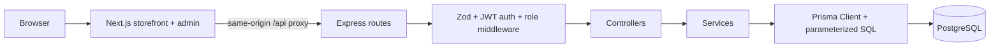
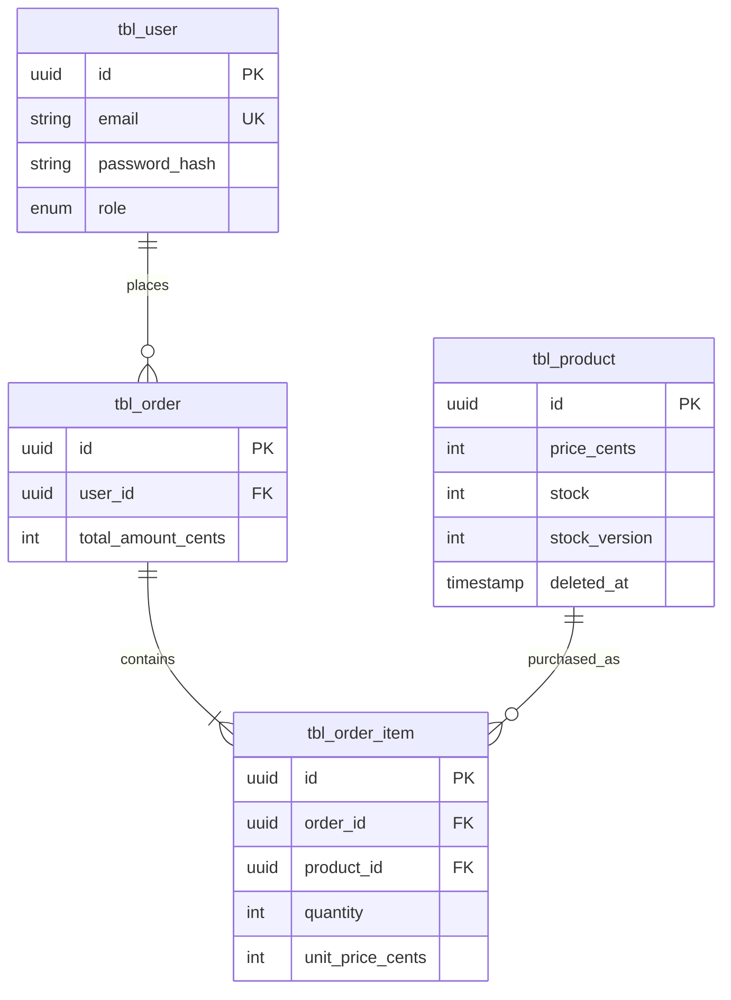

# Architecture

> **Status:** Authentication and admin product/image/inventory management with transactional change logs are implemented.
> Storefront, persistent carts, idempotent checkout and private order history are also implemented. All business pages and APIs require authentication.

[SPEC.md](./SPEC.md) defines the required behavior and acceptance criteria. This document records the technical design
and its trade-offs.

## 1. Overview

Mandai Assessment is a small product storefront and inventory dashboard. One Next.js application serves customer and
admin pages. A separate Express API owns authentication, authorization, product writes, and purchasing. PostgreSQL is
the source of truth for inventory and orders.



The Next.js proxy keeps browser requests and the authentication cookie on one origin. Express remains the API authority;
hiding an admin link in the UI never grants or removes permission.

## 2. Technology choices

| Choice                                     | Reason                                                                                                           |
|--------------------------------------------|------------------------------------------------------------------------------------------------------------------|
| Next.js App Router + TypeScript + Tailwind | One application can serve both page families with shared components and typed UI code.                           |
| Express + TypeScript                       | A small explicit HTTP pipeline is easier to read and explain than a large framework for this scope.              |
| PostgreSQL                                 | Row locking, conditional updates, constraints, and transactions fit inventory and order relationships.           |
| Prisma                                     | Typed models and routine queries; a targeted raw SQL statement expresses the critical inventory update directly. |
| Zod                                        | Reject invalid external input at the HTTP boundary.                                                              |
| JWT + bcrypt                               | Simple take-home authentication with hashed passwords and signed short-lived identity claims.                    |
| pnpm workspaces                            | One repository and dependency graph for the web and API applications.                                            |

## 3. Repository structure

```text
mandai-assessment/
├── apps/
│   ├── web/
│   │   ├── app/                 # storefront, auth, and admin routes
│   │   ├── components/          # shared layout, product, and UI pieces
│   │   └── lib/                 # API client and presentation helpers
│   └── api/
│       └── src/
│           ├── app.ts          # authenticated API composition and errors
│           ├── auth.ts         # sessions and roles
│           ├── products.ts     # product, image, movement and audit routes
│           ├── commerce.ts     # carts, checkout transaction and order reads
│           ├── db.ts           # Prisma PostgreSQL adapter
│           ├── seed.ts         # local demo users
│           └── server.ts       # API listener and image cleanup
├── prisma/                     # schema and checked-in SQL migrations
├── prisma7.config.ts           # Prisma 7 database connection and migration paths
├── DESIGN.md                   # visual source of truth
├── SPEC.md                     # behavior and acceptance criteria
├── ARCHITECTURE.md
├── README.md
├── docker-compose.yml
├── pnpm-workspace.yaml
└── .env.example
```

Commerce lives in one domain module, keeping the transaction and its HTTP boundary close enough to explain in an interview.
Frontend storefront, cart and order components reuse the workspace shell and visual primitives.

## 4. Database schema

Use UUID primary keys and UTC timestamps. All PostgreSQL tables use the requested `tbl_` prefix and singular snake_case
names. Database columns use snake_case. Prisma models remain singular PascalCase and their fields, like API JSON, use
camelCase. Prisma `@@map` and `@map` keep these naming layers separate. This is a naming convention, not a SQL
requirement; PostgreSQL permits underscores and also permits mixed-case identifiers when
quoted. [Prisma's database-mapping documentation](https://docs.prisma.io/docs/orm/v6/prisma-schema/data-model/database-mapping)
describes the mapping mechanism.

| Prisma model | PostgreSQL table | PostgreSQL columns                                                                                                        | Relationships                                                                |
|--------------|------------------|---------------------------------------------------------------------------------------------------------------------------|------------------------------------------------------------------------------|
| `User`       | `tbl_user`       | `id`, `email` (unique), `password_hash`, `role`, `created_at`, `updated_at`                                               | One user has many orders.                                                    |
| `Product`    | `tbl_product`    | `id`, `name`, `description`, `price_cents`, `stock`, `stock_version`, `deleted_at` (nullable), `created_at`, `updated_at` | One product has many order items.                                            |
| `Order`      | `tbl_order`      | `id`, `user_id`, `request_id`, `request_hash`, `total_amount_cents`, `created_at`                                                                       | Belongs to a user; has multiple purchase-time order items. |
| `OrderItem`  | `tbl_order_item` | `id`, `order_id`, `product_id`, `product_name`, `quantity`, `unit_price_cents`                                                            | Belongs to an order and a product.                                           |

`Cart` (`tbl_cart`) has one row per user with an integer version. `CartItem` (`tbl_cart_item`) has a composite
`(user_id, product_id)` primary key, product foreign key and quantity constraint of 1–100. Cart rows are created lazily.
Orders have a unique `(user_id, request_id)` index and a SHA-256 request hash. Legacy orders may have null request fields;
new checkout requests require them. The migration backfills legacy item names from their referenced products before
making `product_name` non-null. Historical names before this migration cannot be reconstructed.

The current Prisma schema maps `Product.priceCents` to `tbl_product.price_cents`. An abbreviated example:

```prisma
model Product {
  id         String @id @db.Uuid
  priceCents Int    @map("price_cents")

  @@map("tbl_product")
}
```

The snippet illustrates naming only; the complete definition is in [schema.prisma](./prisma/schema.prisma). Plain
columns such as `id` and `stock` need no `@map` because their names are already identical.



**Inventory:** The [initial migration](./prisma/migrations/20260925040959_init/migration.sql) adds `CHECK (stock >= 0)`
on `tbl_product` in PostgreSQL. It also constrains `price_cents` to `1..10000000`, `stock` to at most `1000000`,
`quantity` to `1..100`, `unit_price_cents` to `1..10000000`, `total_amount_cents` to `1..1000000000`, and
`stock_version >= 0` on their respective tables. The stock column remains an integer; availability labels are derived in
the UI, never stored. Prisma's schema language does not fully represent PostgreSQL check constraints, so these live in
the SQL migration file. Do not use `prisma db push` as a substitute for that
migration. [Prisma's check-constraint guidance](https://docs.prisma.io/docs/orm/v6/more/troubleshooting/check-constraints)
explains the migration approach.

**Money:** SGD integer cents throughout. Each line is at most 10,000,000 cents × 100 units. Multi-item totals are
calculated from locked database products and must be at most 1,000,000,000 cents; an excess returns 400 and rolls back.
Cart totals may exceed that limit, but the UI disables checkout and asks the user to reduce quantities. OrderItem stores
name and unit-price snapshots, preserving history after metadata changes or archival.

**Deletion:** `DELETE` is a soft delete that sets `deletedAt`. Public reads and purchases exclude deleted products. The
product row and foreign key remain so old order items retain a valid reference. Hard deletion and order-history cleanup
are outside scope.

**Admin stock adjustments:** Metadata PATCH rejects stock. The stock-movements endpoint accepts IN/OUT, a positive
quantity and a reason. Within one transaction, `SELECT ... FOR UPDATE` locks the product; the API checks active state
and resulting stock bounds, applies the increment/decrement, increments stockVersion, and inserts the stock movement
and product change log. This serializes concurrent adjustments and remains compatible with purchase updates.
Product edit/archive also lock the row, ensuring their log snapshots reflect the values actually changed.

**Images and audit:** ProductImage stores uploader ownership, optional product ownership, file metadata and position;
Product.coverImageId identifies the selected gallery member, validated transactionally by the API. Attachment locks
image rows in stable order. Files live in UPLOAD_DIR and are decoded/re-encoded to WebP. Unattached images expire after
24 hours; database cleanup uses an atomic conditional DELETE that rechecks concurrent attachments. ProductLog stores
operator/name snapshots and JSON field changes with optional movement linkage, in the same transaction as the change.
There are no application update/delete endpoints for logs. History intentionally survives product archiving.

See [README.md](./README.md#added-api-contracts) for current image, stock and log contracts; stock changes are incremental operations, never absolute-stock metadata PATCH requests.

## 5. API architecture and contracts

The pipeline is **route → authentication/role middleware → domain handler → Prisma/PostgreSQL**. Domain handlers
validate Zod schemas, shape responses and own business transactions. Prisma handles normal persistence; tagged, parameterized raw SQL handles the stock
update. There is no repository layer or in-memory inventory lock.

All responses use camelCase JSON. Success objects are `{ "data": ... }`; lists use `{ "data": [...] }`. Errors use
`{ "error": "MACHINE_CODE", "message": "Human-readable message." }`, optionally with safe validation `details`. Never
expose hashes or internal database errors.

| Method | Path                      | Access            | Success                                    | Main failures                     |
|--------|---------------------------|-------------------|--------------------------------------------|-----------------------------------|
| POST   | `/api/auth/register`      | Public            | `201` user summary; auth cookie            | `400`, `409 EMAIL_IN_USE`         |
| POST   | `/api/auth/login`         | Public            | `200` user summary; auth cookie            | `400`, `401 INVALID_CREDENTIALS`  |
| POST   | `/api/auth/logout`        | Any               | `200` after clearing cookie                | —                                 |
| GET    | `/api/auth/me`            | Authenticated     | `200` user summary                         | `401`                             |
| GET    | `/api/products`           | Authenticated     | `200` active products                      | —                                 |
| GET    | `/api/products/:id`       | Authenticated     | `200` active product                       | `400`, `404`                      |
| GET    | `/api/admin/products`     | `ADMIN`           | `200` active inventory with `stockVersion` | `401`, `403`                      |
| GET    | `/api/admin/products/:id` | `ADMIN`           | `200` active product with `stockVersion`   | `400`, `401`, `403`, `404`        |
| POST   | `/api/admin/products`     | `ADMIN`           | `201` product                              | `400`, `401`, `403`               |
| PATCH  | `/api/admin/products/:id` | `ADMIN`           | `200` product                              | `400`, `401`, `403`, `404`, `409` |
| DELETE | `/api/admin/products/:id` | `ADMIN`           | `200` archived product summary             | `400`, `401`, `403`, `404`        |
| GET | `/api/cart` | Authenticated | Own cart, version, live availability and total | `401` |
| POST | `/api/cart/items` | Authenticated | `201` updated cart | `400`, `404`, `409` |
| PATCH / DELETE | `/api/cart/items/:id` | Authenticated | `200` updated cart | `400`, `404`, `409` |
| POST | `/api/checkout` | Authenticated | `201` new / `200` replayed order | `400`, `409` |
| GET | `/api/orders` | Authenticated | Own orders, newest first, 20/page | `400` |
| GET | `/api/orders/:id` | Authenticated | Own receipt | `400`, `404` |

Register accepts `{email, password}` and always creates a `USER`; no public role input. Login accepts the same fields.
Product create accepts metadata, initial stock and image selection. Metadata PATCH rejects stock; inventory changes
use the separate stock-movements endpoint. Public product reads omit stockVersion. Catalog lists are deliberately
unpaginated for the small assessment dataset; order history is paginated.

Cart add accepts `{productId, quantity, version}`, quantity update accepts `{quantity, version}`, and removal accepts
`{version}`. Add increments an existing item; PATCH sets its absolute quantity. The account cart is limited to 100
products. All writes lock the cart and compare versions, then increment the version. GET also locks the cart while
reading its version/items to avoid mixing different cart revisions. No cart operation reserves inventory.

Checkout accepts `{requestId, version, items:[{productId, quantity, priceCents}]}`. UUIDs are normalized to lowercase;
quantities are 1–100, product IDs are unique, and input objects reject unknown fields. The frontend submits only
available entries. The API verifies every submitted entry belongs to the current cart with the same quantity.
Price is a displayed-price assertion, never an authority for the order total.

Cart reads mark archived, sold-out and insufficient-quantity entries unavailable, while leaving them in the cart.
Checkout removes only submitted/purchased items. The receipt contains order ID/time/total and purchase-time item
names, quantities and prices. Internal request hashes and user IDs are not exposed in receipts.

## 6. Authentication and authorization

Passwords are hashed with bcrypt before storage. Successful registration/login sets a signed JWT in an `HttpOnly`,
`SameSite=Strict` cookie scoped to `/`; use `Secure` outside local HTTP development. The token contains only user ID,
role, issued time, and expiry. Plan a one-hour expiry; logout clears the cookie. Logout does not revoke an already
copied token, a known limitation of this stateless approach.

The Next.js app proxies `/api/*` to Express, so browser API calls and the cookie are same-origin. Express verifies the
JWT on every protected request. Role middleware checks `ADMIN` on every admin route. The server ignores any claimed role
in registration, product bodies, or frontend state. UI route guards improve navigation but are not a security boundary.
Treat database user/role records as authoritative where revocation or immediate role changes matter; the implemented
middleware reloads the database user and role on each protected request. Copied tokens remain usable until expiry unless
the user is deleted.

## 7. Purchase transaction

`commerce.ts` uses one interactive Prisma transaction at READ COMMITTED:

1. Create the cart if missing with INSERT ON CONFLICT DO NOTHING, then SELECT its row FOR UPDATE.
2. Look up the order by authenticated user and requestId. If it exists, compare the canonical request hash and return
   the existing receipt. Check this before cart version, because a successful checkout changes that version.
3. Check the expected cart version and submitted quantities against the user's cart.
4. Sort product IDs and lock each product FOR UPDATE in that order. Validate active state, stock and displayed price.
5. Decrement with parameterized conditional SQL and increment stockVersion:

```sql
UPDATE tbl_product
SET stock = stock - $2,
    stock_version = stock_version + 1,
    updated_at = CURRENT_TIMESTAMP
WHERE id = $1 AND deleted_at IS NULL AND stock >= $2;
```

6. Check the total bound; insert order and item snapshots, negative stock movements and PURCHASE logs with order IDs.
7. Remove purchased cart items, increment cart version, and commit. Any error rolls back every step.

Known unavailable entries are skipped before submission. If a submitted item changes stock, price or archive state,
the whole submitted purchase fails with 409. The UI refreshes and requires another explicit checkout; it never silently
changes the purchased subset or unit prices. Transaction timeout is 15 seconds, max connection wait is 10 seconds;
unexpected database errors return 500 and are not disguised as stock conflicts.

## 8. Concurrency strategy

All writes to one user's cart use the same cart lock. Checkout holds it until commit, preventing lost edits or two
orders consuming the same cart version. Different users have different cart locks; their shared product locks coordinate
inventory. Product IDs are locked in stable order so overlapping multi-product purchases do not invert lock order.
Admin changes lock one product row and participate in the same inventory serialization.

With stock 1, buyer A locks the product and buyer B waits. A decrements, creates the order and commits. B then reads
stock 0 and gets 409; no order or stock movement is created for B. If A rolls back, B sees the original inventory.
The explicit row lock protects the read/check/update sequence; the conditional UPDATE and CHECK(stock >= 0) provide
additional safeguards. This follows [PostgreSQL's documented READ COMMITTED locking behavior](https://www.postgresql.org/docs/current/transaction-iso.html#XACT-READ-COMMITTED).
No JavaScript mutex or Redis lock is required, including across multiple API processes using the same database.

Idempotency uses a unique `(user_id, request_id)` order key. A SHA-256 hash includes the cart version and canonical
sorted product/quantity/displayed-price list. Identical repeats return the original order; changed payloads return 409.
The frontend stores an unresolved request in per-user sessionStorage before sending. On uncertain network/server
responses it retains the exact request and offers Retry checkout, including after reload in that tab. Deterministic
4xx failures clear the pending request and refresh state. No purchase mutation retries automatically. If browser storage
is unavailable, this recovery survives within the mounted page only; order history remains available.

Catalog/cart data refetch on mount and window focus. Checkout invalidates current-client queries, including inventory
and logs. Other sessions see changes on refocus/reload; there is no push feed. Unsaved cart quantity edits must be
submitted before checkout so the summary matches the purchase.

## 9. Error handling

| HTTP | Example code                              | Meaning                                                       |
|------|-------------------------------------------|---------------------------------------------------------------|
| 400  | `VALIDATION_ERROR`                        | Invalid body or route parameter.                              |
| 401  | `UNAUTHENTICATED` / `INVALID_CREDENTIALS` | No valid session or failed login.                             |
| 403  | `FORBIDDEN`                               | Authenticated user lacks `ADMIN` role.                        |
| 404  | `PRODUCT_NOT_FOUND`                       | Product absent or archived.                                   |
| 409  | `INSUFFICIENT_STOCK` / `CART_CHANGED` / `PRICE_CHANGED`  | Stock, cart or price changed; refresh and reconfirm. |
| 500  | `INTERNAL_ERROR`                          | Unexpected failure; details logged server-side.               |

Example insufficient-inventory response:

```json
{ "error": "INSUFFICIENT_STOCK", "message": "Not enough inventory available." }
```

Do not translate unexpected database failures into 409. A transaction failure should return an internal error while
preserving rollback.

## 10. Security

The implementation hashes passwords with bcrypt; validates external input with Zod; uses parameterized Prisma queries;
keeps secrets in environment variables; sets an HttpOnly auth cookie; and enforces `ADMIN` checks in Express. Keep `.env`
and real credentials out of Git. The API should limit CORS to the configured web origin if direct browser access is
enabled; same-origin proxying is the primary browser path. Render user content as text, not raw HTML.

This is take-home security, not a production claim. Before a public deployment, add a deliberate CSRF defense for
cookie-authenticated mutations, refresh token rotation or server-side session revocation, login rate limiting, account
verification, password reset, audit logging, secret rotation, and operational monitoring. `SameSite=Strict` lowers
cross-site request risk but does not replace a full CSRF review, especially with same-site subdomains.

## 11. Technical trade-offs

- **Express vs NestJS:** Express gives visible route/middleware/controller/service flow without decorators or modules
  that add little to this small API.
- **PostgreSQL vs NoSQL:** Orders, item price snapshots, and inventory updates benefit from relational constraints and
  transactions.
- **Conditional update vs application stock check:** The `WHERE stock >= quantity` check and decrement occur in one
  database operation; a separate JavaScript check can become stale before update.
- **Modular monolith vs microservices:** One API and one database keep the consistency boundary and deployment
  understandable.
- **Prisma vs direct SQL:** Prisma is useful for types and normal CRUD. A small parameterized SQL update makes
  PostgreSQL's inventory guarantee explicit.
- **Soft delete vs hard delete:** Archiving keeps order references and price history intact, at the cost of filtering
  archived products in reads.
- **JWT cookie vs server session:** The cookie simplifies this take-home's single-origin browser flow; immediate
  revocation needs more infrastructure or shorter expiry.

## 12. Testing strategy and roadmap

Node's test runner and Supertest exercise the actual Express handlers against disposable real PostgreSQL databases,
applying every checked-in migration. No transaction mocks. Each suite drops its own database on completion.
`pnpm test` also runs web route protection tests. `pnpm typecheck`, `pnpm lint` and the web build validate static output.

Commerce coverage: cart persistence/isolation and stale edits; invalid inputs; skipped unavailable items; name/price
snapshots and owner-only history; two buyers for one unit; 12 buyers for three units; identical and different-request-ID
repeat purchases; multi-item rollback on stock, price or archive conflicts; inverse product order without deadlocks;
purchase versus admin stock-out; total overflow; forced order/item/movement/log insertion failure with full rollback.

Manual browser acceptance covers search/detail/add, quantity editing, greyed unavailable items, checkout receipt/history,
keyboard navigation and narrow/mobile layouts. Browser checks require an available browser connection.

## 13. Future improvements

Payment and reservations, shipping/refunds, catalog pagination, rate limiting, token revocation, monitoring and deployment
automation remain outside this assessment. Carts, order history, basic catalog search and checkout idempotency are implemented.
