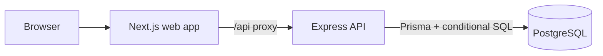

# Mandai Assessment

A small full-stack product management take-home: one customer storefront, one admin inventory dashboard, and one API
whose purchase flow is designed to prevent overselling.

> **Current state:** Authentication, admin inventory management, product browsing, database-backed carts,
> multi-product checkout and order history are implemented. Checkout prevents overselling and duplicate orders.
> Catalog pages, active product APIs and attached active-product images are public. Cart, checkout and personal orders require USER; administration requires ADMIN. No payment gateway is used.

## Features

### Storefront

- Register, sign in/out, search and browse products, inspect details, and add items to a persistent account cart.
- Edit cart quantities, resolve unavailable items before whole-cart checkout, checkout without payment, and view private order history.
- Clear price/stock conflict feedback, atomic multi-product orders, and safe retry after an uncertain response.

### Admin

- Protected inventory overview with product, price, stock, status, and actions.
- Create, view, edit and archive products in dialogs. Upload up to 8 images and select/reorder the cover.
- Separate stock-in/out adjustments with reasons, operator identity and history.
- Read-only product logs show field-level before/after values, including archived products.
- Paginated all-customer orders and read-only details show customer email, time, quantities, snapshots and SGD total. ADMIN cannot purchase.

### Backend and correctness

- Express API with Zod validation, bcrypt password hashes, JWT cookie authentication, and server-side `ADMIN` checks.
- One PostgreSQL transaction performs an atomic conditional stock decrement and creates the order and order item
  together.
- A database `CHECK (stock >= 0)` and a real PostgreSQL concurrency test provide defense and evidence.

Storefront, purchasing and admin inventory management are implemented. Real PostgreSQL integration tests cover
concurrent buyers, repeat requests, admin stock competition and transactional rollback.

## Tech stack

| Area          | Choice                                                              |
|---------------|---------------------------------------------------------------------|
| Web           | Next.js App Router, TypeScript, Tailwind CSS                        |
| API           | Node.js, Express, TypeScript, Zod                                   |
| Data          | PostgreSQL, Prisma ORM, focused parameterized SQL                   |
| Auth          | JWT in an HttpOnly cookie, bcrypt, `ADMIN` and `USER` roles         |
| Tests         | Node test runner, Supertest, isolated real PostgreSQL databases |
| Local tooling | pnpm workspaces, Docker Compose                                     |

## Architecture



The same Next.js app serves the store and admin pages. Express validates input and enforces roles before domain route handlers
reach PostgreSQL. [SPEC.md](./SPEC.md) defines required behavior and acceptance
criteria; [ARCHITECTURE.md](./ARCHITECTURE.md) explains the database model, transaction design, and trade-offs.

## Getting started

### Requirements

- Node.js 20.19.x or later 20.x, 22.12.x or later 22.x, or 24.0+ (installed Prisma requires `^20.19 || ^22.12 || >=24.0`)
- pnpm (Corepack is fine)
- Docker with Compose

### Run locally

```bash
cd mandai-assessment
cp .env.example .env
docker compose up -d
pnpm install
pnpm db:deploy
pnpm db:generate
pnpm dev
```

Run `pnpm db:seed`, then open `http://localhost:3000` to sign in. `http://localhost:4000/api/health` checks Express
directly; `http://localhost:3000/api/health` checks the Next.js proxy to Express. The root `pnpm dev` script starts both
workspace apps. If port 5432 is occupied, change the Compose host port and the `DATABASE_URL` in `.env` together.

The scaffold was created with the [official Next.js CLI](https://nextjs.org/docs/app/getting-started/installation) and
the [official Express application generator](https://expressjs.com/en/starter/generator/). Express's generated
JavaScript example was then converted using
the [official TypeScript setup](https://expressjs.com/en/starter/installing/) and trimmed to an API health route. The
API uses `tsx` to run TypeScript across Node builds, including those without native TypeScript support. The Next.js
starter uses the App Router, TypeScript, Tailwind CSS, and ESLint. One root pnpm lockfile manages both apps.

### Database migrations

The initial [Prisma schema](./prisma/schema.prisma)
and [SQL migration](./prisma/migrations/20260925040959_init/migration.sql) create `tbl_user`, `tbl_product`,
`tbl_order`, and `tbl_order_item`. The SQL migration includes `CHECK (stock >= 0)` and the documented price, stock,
quantity, and total bounds. `pnpm db:migrate` applies pending migrations to the local development database. Prisma 7
requires `pnpm db:generate` separately after schema changes. Use `pnpm db:status` to check migration state; use
`pnpm db:deploy` to apply checked-in migrations in deployment
environments. [Prisma's development migration guide](https://www.prisma.io/docs/orm/v7/prisma-migrate/workflows/development-and-production)
describes the distinction.

To add another table:

```bash
# 1. Add a model to prisma/schema.prisma with @@map("tbl_example")
#    and @map("snake_case_column") for fields whose names differ.
# 2. Generate SQL without applying it, so database checks can be reviewed.
pnpm exec prisma migrate dev --create-only --name add_example
# 3. Review and, if needed, edit the new prisma/migrations/*/migration.sql.
pnpm db:migrate
pnpm db:generate
pnpm db:status
```

The Prisma model name remains singular PascalCase, such as `Example`, while `@@map("tbl_example")` sets its actual
PostgreSQL table name. `@map` does the same for a column. Do not use `prisma db push` here: it bypasses the checked-in
SQL checks. Run `pnpm db:seed` to create development demo accounts. Existing accounts are left unchanged.

## Environment variables

Copy [.env.example](./.env.example) to `.env`. `DATABASE_URL` connects the Prisma CLI to the local database and connects
the API. `POSTGRES_USER`, `POSTGRES_PASSWORD`, and `POSTGRES_DB` configure Compose. `API_PORT` sets Express's port,
`WEB_ORIGIN` will define the allowed web origin, and `JWT_SECRET` signs authentication tokens. The Next.js proxy targets
port 4000 by default; if the API port changes, set `API_PROXY_TARGET` in the web process environment. Replace the sample
JWT secret before deployment. `.env` is ignored by Git; the checked-in values are local development examples only.

## Demo accounts

Run `pnpm db:seed` to create `admin@example.com` (`ADMIN`) and `user@example.com` (`USER`). Both new accounts use **
`DemoPass123!`**, for local development only. Re-running the seed does not reset existing passwords or roles. Public
registration always creates `USER`.

Admin order reads: `GET /api/admin/orders?page=1` returns `{items,total,page,pageSize}` (20/page, newest time then ID descending); `GET /api/admin/orders/:id` returns one receipt. Both require ADMIN, expose `customerEmail` alongside item snapshots/time/total, and omit request hashes. USER receives 403; guests receive 401. Missing detail returns 404. There are no order mutation endpoints.

Images: `GET /api/product-images/:id` is public only for an image bound to a non-archived product. Unattached uploads require the uploading ADMIN's current session; other authenticated accounts receive 404 and guests receive 401. Archived-product images return 404. Responses remain `private, no-store` to avoid retaining images after archival.

## Authentication and route groups

The `(auth)` group contains the shared `/login` and `/register` pages. `(app)` contains `/`; `(admin)` contains
`/admin`. Parenthesized directories do not change URLs or enforce permissions themselves.

`apps/web/proxy.ts` is the Next.js 16 name for Middleware. It applies the rules in `lib/route-access.ts` before
rendering all page requests: catalog `/` and `/products/[id]` are public; other business pages require login by default; `/admin` and descendants additionally require
`ADMIN`. Signed-in users visiting login/register return to their role’s home page. Unknown paths require authentication
and then show the themed 404. Static framework assets and `/api` are excluded. Put additional public static assets in an
explicitly excluded path if added later; never exclude arbitrary file extensions because business URLs may contain dots.

The proxy verifies sessions with Express `/api/auth/me`, forwards the session cookie, and does not cache identity
responses. Service failures return 503 instead of granting access. USER is redirected from admin pages to `/`;
unauthenticated users on private pages go to `/login`. ADMIN cannot enter customer cart/order pages and is redirected to `/admin`. API requests receive JSON 401/403 errors instead of redirects. Private API routers are mounted below authentication and role guards; only catalog reads and authorized image reads precede authentication.

JWT sessions last one hour in an HttpOnly, SameSite=Strict cookie with `Path=/` and Secure in production. The API looks
up the current database user/role for each protected request. Logout clears the cookie; copied tokens are not revoked
before expiry. Set a random `JWT_SECRET` of at least 32 characters before running outside a local demo. Passwords use
bcrypt. No token is stored in localStorage.

### Auth verification

`pnpm test` creates a uniquely named disposable PostgreSQL database, applies the checked-in migration, runs
authentication and route-policy tests, and drops that test database. The connection from `DATABASE_URL` needs permission
to create databases. Tests do not modify development records. Run `pnpm lint`, `pnpm typecheck`, and
`pnpm --filter @mandai/web build` for static checks.

## Web routes

| Web route              | Purpose                             |
|------------------------|-------------------------------------|
| `/`                    | Product storefront                  |
| `/products/[id]`       | Product details and add to cart     |
| `/cart`                 | Persistent cart and checkout         |
| `/orders`               | Paginated order history              |
| `/orders/[id]`          | Order receipt and purchase snapshots |
| `/login`, `/register`  | Authentication                      |
| `/admin`               | Inventory summary                   |
| `/admin/products`      | Table-oriented inventory management |
| `/admin/product-logs`   | Filtered product and purchase logs   |

Shared UI pieces include `AppHeader`, `AdminSidebar`, `PageContainer`, `ProductCard`, `ProductTable`,
`ProductForm`, `StockBadge`, `QuantitySelector`, and small `Button`, `Input`, `Badge`, `Table`, and `Dialog` primitives.
The admin table will right-align price/stock and derive **In Stock**, **Low Stock**, and **Sold Out** from the current
stock.

## API overview

| Method | Endpoint                  | Access                 |
|--------|---------------------------|------------------------|
| POST   | `/api/auth/register`      | Public; creates `USER` |
| POST   | `/api/auth/login`         | Public                 |
| POST   | `/api/auth/logout`        | Any session state      |
| GET    | `/api/auth/me`            | Authenticated          |
| GET    | `/api/products`           | Public          |
| GET    | `/api/products/:id`       | Public          |
| GET    | `/api/admin/products`     | `ADMIN`                |
| GET    | `/api/admin/products/:id` | `ADMIN`                |
| POST   | `/api/admin/products`     | `ADMIN`                |
| PATCH  | `/api/admin/products/:id` | `ADMIN`                |
| DELETE | `/api/admin/products/:id` | `ADMIN`; soft delete   |
| GET    | `/api/cart`                 | `USER`; own cart |
| POST   | `/api/cart/items`           | `USER`; add quantity |
| PATCH  | `/api/cart/items/:id`       | `USER`; set quantity |
| DELETE | `/api/cart/items/:id`       | `USER`; remove item |
| POST   | `/api/checkout`             | `USER`; atomic purchase |
| GET    | `/api/orders`               | `USER`; own orders, 20/page |
| GET    | `/api/orders/:id`           | `USER`; own order |

Cart writes include `version`. Add accepts `{productId, quantity, version}`, PATCH accepts `{quantity, version}`,
and DELETE accepts `{version}`. One cart supports 100 different products, each with quantity 1–100.
Checkout accepts `{requestId, version, items:[{productId, quantity, priceCents}]}`. Prices are SGD integer cents;
the server verifies displayed prices and computes the total from locked database rows (maximum 1,000,000,000 cents).
First success returns `201`; replaying the same user/requestId and payload returns `200` with the original order.
Reusing a requestId for different contents returns `409 REQUEST_REUSED`.

Unavailable cart entries remain in the cart and displayed total and block the entire checkout. The customer must explicitly remove them or reduce quantities. The server rejects subsets of the cart.
If a submitted product becomes unavailable or changes price, the whole request rolls back with `409`; the UI refreshes
and asks the user to review before another checkout. Success removes only purchased items and opens the order receipt.
Orders store name and price snapshots. USER reads only their own orders; ADMIN reads all orders through separate protected read-only endpoints.

## Inventory concurrency

Checkout locks the user's cart, checks idempotency and cart version, then locks product rows in sorted UUID order.
It validates current stock, active state and displayed price, and performs a conditional decrement:
`UPDATE tbl_product SET stock = stock - $2, stock_version = stock_version + 1 WHERE id = $1 AND stock >= $2 ...`.
Order, items, stock movements, PURCHASE logs and cart cleanup commit together. Any failure rolls everything back.
Admin stock adjustments use the same product row locks. No in-process mutex, Redis or queue is needed.

With stock 1 and two simultaneous quantity-1 purchases, one succeeds, one receives 409, final stock is 0,
and only one order is created. A unique `(user_id, request_id)` order index plus cart serialization prevents
repeated submissions from decrementing stock twice. The browser retains unresolved checkout requests in per-user
sessionStorage so a reload/retry in the same tab can retrieve the original result. Authentication/authorization
failures preserve that request: sign in with the original USER account, return to the cart in the same tab and retry.
The client checks account identity before submitting; successful responses and explicit checkout validation/conflict
responses resolve the pending request. Account lookup failures display a retry control and do not establish a guest session.

## Testing

`pnpm test` runs frontend tests and Node test runner / Supertest against uniquely named disposable PostgreSQL databases. Review DATABASE_URL first: API suites connect to that control database, CREATE separate `mandai_{auth,products,commerce}_test_<pid>_<timestamp>` databases, apply migrations there and DROP those databases WITH (FORCE) afterward. Run only against an explicitly approved test target. It does not
modify development records. The DATABASE_URL user needs CREATE DATABASE permission. Coverage includes authentication,
admin CRUD/uploads/audit, cart isolation and stale edits, order ownership/snapshots, last-unit competition, 12 concurrent
buyers competing for 3 units, reverse-order multi-item carts, duplicate checkouts, purchase versus admin stock-out,
and forced order/item/movement/log failures with complete rollback.

Run `pnpm typecheck`, `pnpm lint`, and `pnpm --filter @mandai/web build` for static/build verification.
Manual browser acceptance: sign in, search/open a product, add and edit items, verify unavailable items are greyed out,
checkout, inspect history, and check keyboard access and mobile widths. A browser connection is needed for visual checks.

## Project structure

```text
mandai-assessment/
├── apps/
│   ├── web/              # Next.js storefront, cart, orders and admin
│   └── api/              # generated Express app adapted to TypeScript
├── prisma/               # schema and checked-in SQL migrations
├── prisma7.config.ts
├── DESIGN.md
├── SPEC.md
├── ARCHITECTURE.md
├── README.md
├── docker-compose.yml
├── pnpm-workspace.yaml
└── .env.example
```

## Design

[DESIGN.md](./DESIGN.md) is the visual source of truth. It
adapts [the Linear-inspired reference](https://github.com/VoltAgent/awesome-design-md/blob/main/design-md/linear.app/DESIGN.md)
into a restrained dark dashboard and storefront with subtle borders, deliberate spacing, clear status, and a limited
lavender accent. The UI uses a system font stack and the project’s own product layout.

## Trade-offs and roadmap

This is a modular monolith with one relational database. Prisma handles standard data access; parameterized SQL
expresses the inventory-critical update. Soft deletion preserves order history. Token revocation, rate limiting, inventory reservations and payment are deferred. Checkout idempotency is implemented. Testing details are in [ARCHITECTURE.md](./ARCHITECTURE.md#12-testing-strategy-and-roadmap). The project repository
is [jieshenghow/mandai](https://github.com/jieshenghow/mandai).

## Frontend POST requests

The root layout installs a client-side `QueryProvider` from TanStack Query. Login, registration, and logout use
`useMutation`; the shared `postApi<T>()` helper sends JSON with the existing HttpOnly cookie and throws API errors for
the form to display. Mutations do not automatically retry. Logout clears the query cache before navigating back to
login.

For a new POST action, call `postApi<Result>("/api/your-endpoint", input)` from a `useMutation` mutation function, use
`isPending` to disable duplicate submission, and show `error.message` on failure. When a future mutation changes cached
product data, invalidate the corresponding query key in `onSuccess`. The server route guard continues to use server-side
fetch.

## Product management

Sign in as an administrator and open `/admin/products`. Use **Add product**, **View**, **Edit**, **Stock in**,
**Stock out**, or **Delete**. Delete archives the product; it does not erase orders or history. Initial stock is
entered during creation. Later changes use positive adjustment quantities and a required reason, never an absolute
stock overwrite. The API locks the product row and writes inventory, movement and change log in one transaction.

`/admin/product-logs` shows successful product changes only: creation, edits, images/cover/order, stock adjustments and
archiving and purchase deductions. Filter by product name, operator email, action and date; pages contain 20 records. Product details also
include this history. Operator identity comes from the authenticated server session. Failed actions, browsing,
login/logout and abandoned uploads are not logged. Logs have no mutation endpoint. Snapshots retain operator email
and product name; image changes retain image IDs rather than permanent copies of removed image bytes.

### Local image storage

Uploads are written to `<repository>/uploads` by default. Set `UPLOAD_DIR` to an absolute writable directory to override.
In deployment, mount this directory on persistent storage and back it up together with PostgreSQL. Multiple API
instances must share that directory. Uploaded files are excluded from Git; they are not stored in Next.js `public`.

Each product supports 0–8 images, up to 5 MB per input file, in JPG/PNG/WebP format. Animated files and images over
40 megapixels are rejected. The API decodes and re-encodes images as WebP, stripping metadata. Images are read via
the product-image API: images attached to active products are public; unattached previews require their uploading ADMIN session. Unattached uploads and removed
images expire after 24 hours and are cleaned on API startup and hourly. Archived product images remain stored.
After interrupted uploads, orphan file cleanup runs on the same schedule. No cloud account is required.

### Added API contracts

All admin endpoints require `ADMIN`. JSON responses retain `{data}` / `{error,message,details?}` envelopes.

| Method | Endpoint | Input / behavior |
|---|---|---|
| GET | `/api/products`, `/api/products/:id` | Public active product reads; omit stock version |
| GET/POST | `/api/admin/products` | List / create; create accepts name, description, priceCents, stock, imageIds, coverImageId |
| GET/PATCH/DELETE | `/api/admin/products/:id` | Read / edit metadata and image selection / archive; PATCH rejects stock |
| POST | `/api/admin/product-images` | Multipart field `image`, one file; returns id and a URL private until attached |
| GET | `/api/product-images/:id` | Public active-product images; uploading ADMIN only for unattached previews |
| GET/POST | `/api/admin/products/:id/stock-movements` | History / `{type:"IN" or "OUT", quantity, reason}` |
| GET | `/api/admin/product-logs` | Optional productId, product (name), actor (email), action, from/to (ISO timestamp), page |

An image must belong to the product or be an unattached upload owned by the current administrator. Omit imageIds
on PATCH to preserve the gallery. When supplied, imageIds is the complete ordered selection; removing the current
cover chooses the first remaining image. Empty galleries have a null cover. Stock adjustments return `409 STOCK_LIMIT`
when inventory would leave 0–1,000,000. Successful adjustments and purchases increment stockVersion. Purchases append stock movements and PURCHASE product logs.

### Verification

`pnpm test` creates isolated PostgreSQL databases and applies migrations without changing development data. The database
user needs CREATE DATABASE permission. Tests cover permissions, CRUD, image validation/ownership/cleanup, log filters,
concurrent last-unit stock-out and transactional rollback when audit insertion fails. `pnpm typecheck`, `pnpm lint`, and
`pnpm --filter @mandai/web build` provide static/build checks. Browser visual, keyboard and responsive checks should be
performed against the running app; they are not automated by the current suite.
