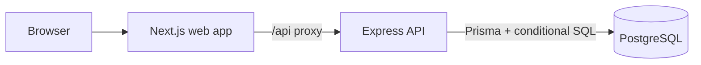

# Mandai Assessment

A small full-stack product management take-home: one customer storefront, one admin inventory dashboard, and one API
whose purchase flow is designed to prevent overselling.

> **Current state:** Login, registration, logout, JWT cookie sessions, page route protection, role checks, and demo
> accounts are implemented. Every business page requires authentication. Product management and purchasing remain planned.

## Features

### Storefront

- Register, sign in/out, browse products, inspect stock, and buy a quantity of one product.
- Clear success and insufficient-inventory feedback. Order history is optional and deferred.

### Admin

- Protected inventory overview with product, price, stock, status, and actions.
- Create, edit, and archive products. Stock edits detect a stale form after another stock change.

### Backend and correctness

- Express API with Zod validation, bcrypt password hashes, JWT cookie authentication, and server-side `ADMIN` checks.
- One PostgreSQL transaction performs an atomic conditional stock decrement and creates the order and order item
  together.
- A database `CHECK (stock >= 0)` and a real PostgreSQL concurrency test provide defense and evidence.

These are the implementation targets. They are not presented as completed functionality yet.

## Tech stack

| Area          | Choice                                                              |
|---------------|---------------------------------------------------------------------|
| Web           | Next.js App Router, TypeScript, Tailwind CSS                        |
| API           | Node.js, Express, TypeScript, Zod                                   |
| Data          | PostgreSQL, Prisma ORM, focused parameterized SQL                   |
| Auth          | JWT in an HttpOnly cookie, bcrypt, `ADMIN` and `USER` roles         |
| Tests         | Vitest or Jest, Supertest, real PostgreSQL for purchase concurrency |
| Local tooling | pnpm workspaces, Docker Compose                                     |

## Architecture



The same Next.js app serves the store and admin pages. Express validates input and enforces roles before service logic
reaches PostgreSQL. [SPEC.md](./SPEC.md) defines required behavior and acceptance
criteria; [ARCHITECTURE.md](./ARCHITECTURE.md) explains the database model, transaction design, and trade-offs.

## Getting started

### Requirements

- Node.js 20.9 or newer
- pnpm (Corepack is fine)
- Docker with Compose

### Run the current scaffold

```bash
cd mandai-assessment
cp .env.example .env
docker compose up -d
pnpm install
pnpm db:migrate
pnpm db:generate
pnpm dev
```

Run `pnpm db:seed`, then open `http://localhost:3000` to sign in. `http://localhost:4000/api/health` checks Express
directly; `http://localhost:3000/api/health` checks the Next.js proxy to Express. The root `pnpm dev` script starts both
workspace apps. If port 5432 is occupied, change the Compose host port and the `DATABASE_URL` in `.env` together.

The scaffold was created with the [official Next.js CLI](https://nextjs.org/docs/app/getting-started/installation) and
the [official Express application generator](https://expressjs.com/en/starter/generator/). Express's generated
JavaScript example was then converted using
the [official TypeScript setup](https://expressjs.com/en/starter/installing/) and trimmed to an API health route. The
API uses `tsx` to run TypeScript across Node builds, including those without native TypeScript support. The Next.js
starter uses the App Router, TypeScript, Tailwind CSS, and ESLint. One root pnpm lockfile manages both apps.

### Database migrations

The initial [Prisma schema](./prisma/schema.prisma)
and [SQL migration](./prisma/migrations/20260925040959_init/migration.sql) create `tbl_user`, `tbl_product`,
`tbl_order`, and `tbl_order_item`. The SQL migration includes `CHECK (stock >= 0)` and the documented price, stock,
quantity, and total bounds. `pnpm db:migrate` applies pending migrations to the local development database. Prisma 7
requires `pnpm db:generate` separately after schema changes. Use `pnpm db:status` to check migration state; use
`pnpm db:deploy` to apply checked-in migrations in deployment
environments. [Prisma's development migration guide](https://www.prisma.io/docs/orm/v7/prisma-migrate/workflows/development-and-production)
describes the distinction.

To add another table:

```bash
# 1. Add a model to prisma/schema.prisma with @@map("tbl_example")
#    and @map("snake_case_column") for fields whose names differ.
# 2. Generate SQL without applying it, so database checks can be reviewed.
pnpm exec prisma migrate dev --create-only --name add_example
# 3. Review and, if needed, edit the new prisma/migrations/*/migration.sql.
pnpm db:migrate
pnpm db:generate
pnpm db:status
```

The Prisma model name remains singular PascalCase, such as `Example`, while `@@map("tbl_example")` sets its actual
PostgreSQL table name. `@map` does the same for a column. Do not use `prisma db push` here: it bypasses the checked-in
SQL checks. Run `pnpm db:seed` to create development demo accounts. Existing accounts are left unchanged.

## Environment variables

Copy [.env.example](./.env.example) to `.env`. `DATABASE_URL` connects the Prisma CLI to the local database and connects
the API. `POSTGRES_USER`, `POSTGRES_PASSWORD`, and `POSTGRES_DB` configure Compose. `API_PORT` sets Express's port,
`WEB_ORIGIN` will define the allowed web origin, and `JWT_SECRET` signs authentication tokens. The Next.js proxy targets
port 4000 by default; if the API port changes, set `API_PROXY_TARGET` in the web process environment. Replace the sample
JWT secret before deployment. `.env` is ignored by Git; the checked-in values are local development examples only.

## Demo accounts

Run `pnpm db:seed` to create `admin@example.com` (`ADMIN`) and `user@example.com` (`USER`). Both new accounts use **
`DemoPass123!`**, for local development only. Re-running the seed does not reset existing passwords or roles. Public
registration always creates `USER`.

## Authentication and route groups

The `(auth)` group contains the shared `/login` and `/register` pages. `(app)` contains `/`; `(admin)` contains
`/admin`. Parenthesized directories do not change URLs or enforce permissions themselves.

`apps/web/proxy.ts` is the Next.js 16 name for Middleware. It applies the rules in `lib/route-access.ts` before
rendering all page requests: business pages require login by default; `/admin` and descendants additionally require
`ADMIN`. Signed-in users visiting login/register return to their role’s home page. Unknown paths require authentication
and then show the themed 404. Static framework assets and `/api` are excluded. Put additional public static assets in an
explicitly excluded path if added later; never exclude arbitrary file extensions because business URLs may contain dots.

The proxy verifies sessions with Express `/api/auth/me`, forwards the session cookie, and does not cache identity
responses. Service failures return 503 instead of granting access. USER is redirected from admin pages to `/`;
unauthenticated users go to `/login`. API requests receive JSON 401/403 errors instead of redirects. Future business API
routers must be mounted below the existing authentication and admin guards.

JWT sessions last one hour in an HttpOnly, SameSite=Strict cookie with `Path=/` and Secure in production. The API looks
up the current database user/role for each protected request. Logout clears the cookie; copied tokens are not revoked
before expiry. Set a random `JWT_SECRET` of at least 32 characters before running outside a local demo. Passwords use
bcrypt. No token is stored in localStorage.

### Auth verification

`pnpm test` creates a uniquely named disposable PostgreSQL database, applies the checked-in migration, runs
authentication and route-policy tests, and drops that test database. The connection from `DATABASE_URL` needs permission
to create databases. Tests do not modify development records. Run `pnpm lint`, `pnpm typecheck`, and
`pnpm --filter @mandai/web build` for static checks.

## Planned routes

| Web route              | Purpose                             |
|------------------------|-------------------------------------|
| `/`                    | Product storefront                  |
| `/products/[id]`       | Product details and purchase        |
| `/login`, `/register`  | Authentication                      |
| `/admin`               | Inventory summary                   |
| `/admin/products`      | Table-oriented inventory management |
| `/admin/products/new`  | Create product                      |
| `/admin/products/[id]` | Edit product and stock              |

Reusable UI pieces will include `AppHeader`, `AdminSidebar`, `PageContainer`, `ProductCard`, `ProductTable`,
`ProductForm`, `StockBadge`, `QuantitySelector`, and small `Button`, `Input`, `Badge`, `Table`, and `Dialog` primitives.
The admin table will right-align price/stock and derive **In Stock**, **Low Stock**, and **Sold Out** from the current
stock.

## API overview

| Method | Endpoint                  | Access                 |
|--------|---------------------------|------------------------|
| POST   | `/api/auth/register`      | Public; creates `USER` |
| POST   | `/api/auth/login`         | Public                 |
| POST   | `/api/auth/logout`        | Any session state      |
| GET    | `/api/auth/me`            | Authenticated          |
| GET    | `/api/products`           | Authenticated          |
| GET    | `/api/products/:id`       | Authenticated          |
| GET    | `/api/admin/products`     | `ADMIN`                |
| GET    | `/api/admin/products/:id` | `ADMIN`                |
| POST   | `/api/admin/products`     | `ADMIN`                |
| PATCH  | `/api/admin/products/:id` | `ADMIN`                |
| DELETE | `/api/admin/products/:id` | `ADMIN`; soft delete   |
| POST   | `/api/products/:id/buy`   | Authenticated          |

Purchase body: `{ "quantity": 2 }`. Product prices are SGD integer `priceCents`. Successful purchases return `201` with
an order receipt; insufficient inventory returns `409` with
`{ "error": "INSUFFICIENT_STOCK", "message": "Not enough inventory available." }`. All errors share that `error`/
`message` shape. See [ARCHITECTURE.md](./ARCHITECTURE.md#5-api-architecture-and-contracts) for input contracts and other
statuses.

## Inventory concurrency

The purchase service will execute
`UPDATE tbl_product SET stock = stock - $2 WHERE id = $1 AND stock >= $2 RETURNING ...` inside the same transaction that
inserts the order. PostgreSQL serializes competing updates on the product row and rechecks the condition after a
competing commit. With stock 1 and two simultaneous quantity-1 requests, one purchase succeeds, one gets 409, final
stock is 0, and only one order is created. [The transaction design](./ARCHITECTURE.md#7-purchase-transaction) explains
the precise behavior and the admin stock-edit strategy.

PostgreSQL tables are `tbl_user`, `tbl_product`, `tbl_order`, and `tbl_order_item`, with snake_case columns. Prisma
fields are camelCase and map to those physical names; the future API will use camelCase JSON. See
the [schema naming contract](./ARCHITECTURE.md#4-database-schema).

## Testing plan

The API test suite will cover valid and invalid login, missing authentication, `USER` receiving 403 on admin routes,
`ADMIN` success, product CRUD and validation, purchase success/failure, and bad quantities. The critical Supertest
integration case must use a real PostgreSQL database:

```text
Given stock = 1
When two purchase requests for quantity 1 start concurrently
Then exactly one returns 201 and one returns 409
And final stock = 0
And exactly one corresponding order and order item exist
```

Authentication and route-policy tests now run with `pnpm test`; product and purchase tests are still planned. Current
checks are `pnpm lint`, `pnpm typecheck`, and `pnpm --filter @mandai/web build`.

## Project structure

```text
mandai-assessment/
├── apps/
│   ├── web/              # generated Next.js app; store + admin to be built
│   └── api/              # generated Express app adapted to TypeScript
├── prisma/               # schema and SQL migration; seed planned
├── prisma7.config.ts
├── DESIGN.md
├── SPEC.md
├── ARCHITECTURE.md
├── README.md
├── docker-compose.yml
├── pnpm-workspace.yaml
└── .env.example
```

## Design

[DESIGN.md](./DESIGN.md) is the visual source of truth. It
adapts [the Linear-inspired reference](https://github.com/VoltAgent/awesome-design-md/blob/main/design-md/linear.app/DESIGN.md)
into a restrained dark dashboard and storefront with subtle borders, deliberate spacing, clear status, and a limited
lavender accent. The UI will use a public/system font and will not copy Linear's product layout.

## Trade-offs and roadmap

This is a modular monolith with one relational database. Prisma handles standard data access; parameterized SQL
expresses the inventory-critical update. Soft deletion preserves order history. Production concerns such as idempotency
keys, token revocation, rate limiting, and payment are deferred. The six implementation phases and their test gates are
in [ARCHITECTURE.md](./ARCHITECTURE.md#12-testing-strategy-and-roadmap). The project repository
is [jieshenghow/mandai](https://github.com/jieshenghow/mandai).

## Frontend POST requests

The root layout installs a client-side `QueryProvider` from TanStack Query. Login, registration, and logout use
`useMutation`; the shared `postApi<T>()` helper sends JSON with the existing HttpOnly cookie and throws API errors for
the form to display. Mutations do not automatically retry. Logout clears the query cache before navigating back to
login.

For a new POST action, call `postApi<Result>("/api/your-endpoint", input)` from a `useMutation` mutation function, use
`isPending` to disable duplicate submission, and show `error.message` on failure. When a future mutation changes cached
product data, invalidate the corresponding query key in `onSuccess`. The server route guard continues to use server-side
fetch.
